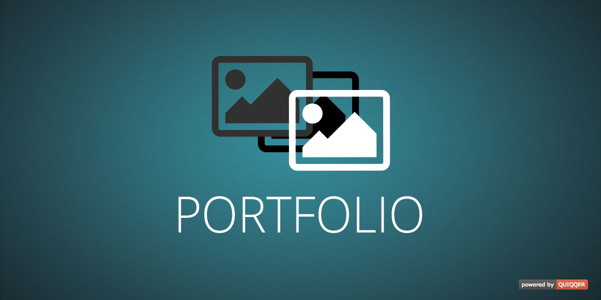

Portfolio
========

Module for references/customer projects etc.

Package Name:

    quiqqer/portfolio

Features
--------

- Sitetype: Reference-List
- Sitetype: Reference-Entry
- Different JavaScript Reference Popups

Installation
------------

The package name is: quiqqer/portfolio

Contribute
----------

- Project: https://dev.quiqqer.com/quiqqer/package-portfolio
- Issue Tracker: https://dev.quiqqer.com/quiqqer/package-portfolio/issues
- Source Code: https://dev.quiqqer.com/quiqqer/package-portfolio/tree/master

Support
-------

If you have found errors, wishes or suggestions for improvement,
you can contact us by email at support@pcsg.de.

We will try to meet your needs or send them to the responsible developers
of the project.

License
-------
- PCSG QL-1.0
- GPL-3.0+
